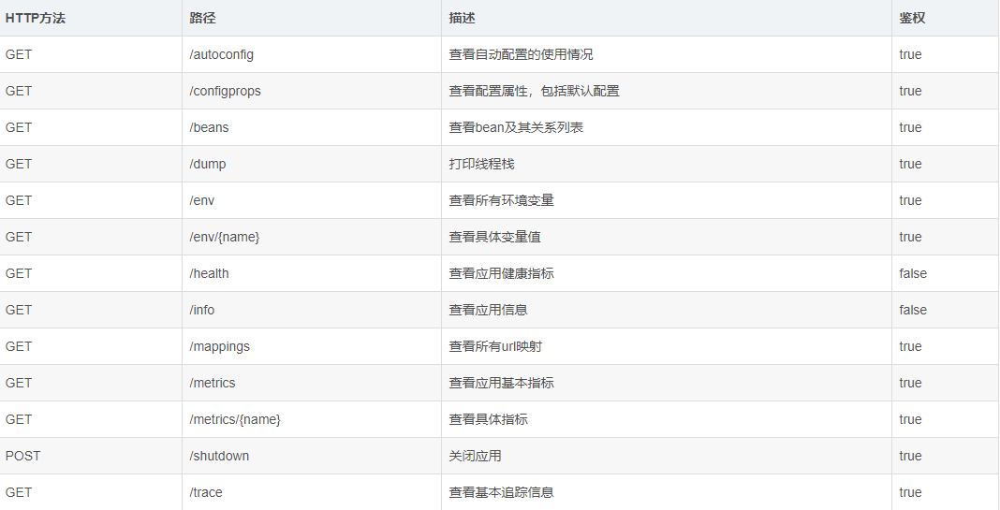

>Actuator监控是springboot提供对应用自身监控，以及对应用系统配置查看等功能。

## 开启actuator监控

springboot使用actuator的方式非常简单，只需要在项目中加入依赖spring-boot-starter-actuator
```xml
<dependency>
	<groupId>org.springframework.boot</groupId>
	<artifactId>spring-boot-starter-actuator</artifactId>
</dependency>
```



**yml配置:**
```yaml
# actuator监控
management:
  security:
    enabled: false #需要集成security
  server:
    # 设置监控服务端口
    port: 8080
  endpoint:
    health:
      show-details: always
  endpoints:
    # 设置端点是否可用 默认只有shutdown可用
    enabled-by-default: true
    web:
      base-path: /actuator #基本路径
      # 设置是否暴露端点 默认只有health和info可见
      exposure:
        # 包括所有端点
        include: "*" # 注意需要添加引号
        # 排除端点
        exclude: shutdown
        # 跨域处理
      cors:
        allowed-origins:   #允许跨域的ip地址
        allowed-methods: post,delete,get,put #允许通过的请求，还有支持时间
info: #下面的值全部自定义即可
  app:
    name: @name@
    description: @description@
    version: v1.0.0
    encoding: @project.build.sourceEncoding@  #应用编码
    java:
      source: @java.version@  #jdk 版本
      target: @java.version@  #jdk 版本
  author:
    name:   #作者姓名
    phone:   #作者联系方式
```

访问 [http://localhost:8080/actuator/info](http://localhost:8080/actuator/info ':target=_blank')，可以看到定义的info信息。

## 定制Actuator

**修改接口ID**

每个Actuator接口都有一个ID用来决定接口的路径，比方说，/beans接口的默认ID就是beans。比如要修改/beans为 /instances，则设置如下：
```yaml
endpoints:
  beans:
    id: instances
```
**启用和禁用接口**

虽然Actuator的接口都很有用，但你不一定需要全部这些接口。默认情况下，所有接口（除了/shutdown）都启用。比如要禁用 /metrics 接口，则可以设置如下：
```yaml
endpoints:
  metrics:
    enabled: false
```
如果你只想打开一两个接口，那就先禁用全部接口，然后启用那几个你要的，这样更方便。
```yaml
endpoints:
  enabled: false
  metrics:
    enabled: true
```

## 集成security对actuator进行权限控制

actuator可以集成security进行权限控制，具体不在描述。

!> actuator实战中我很少用到，用到的监控更多的是Spring Boot Admin（SBA）是一款基于Actuator开发的开源软件，[https://github.com/codecentric/spring-boot-admin](https://github.com/codecentric/spring-boot-admin ':target=_blank')，以图形化界面的方式展示Spring Boot应用的配置信息、Beans信息、环境属性、线程信息、JVM状况等。

