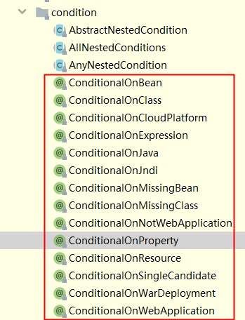
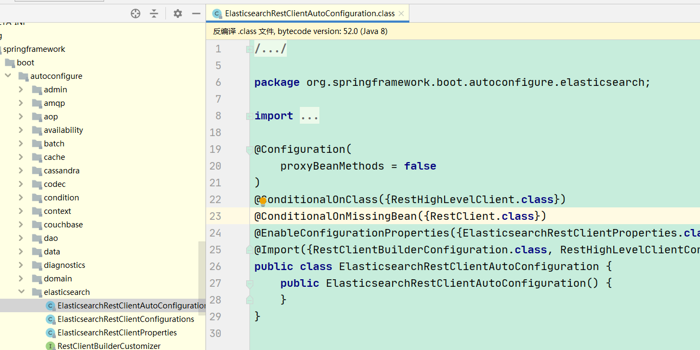

> 当我们构建一个 Spring 应用的时候，有时我们想在满足指定条件的时候才将某个 bean 加载到应用上下文中， 在Spring 4.0 时代，我们可以通过 @Conditional 注解来实现这类操作  
> @Conditional系列注解需结合@Configuration一起使用 

**注解详解**

Spring Boot 对 @Conditional 注解为我们做了细化，这些注解都定义在 org.springframework.boot.autoconfigure.condition package 下



从注解得知
* 都可以应用在 TYPE 上，也就是说，Spring 自动扫描的一切类 (@Configuration, @Component, @Service, @Repository, or @Controller) 都可以通过添加相应的 @ConditionalOnXxxx 来判断是否加载
* 都可以应用在 METHOD 上，所以有 @Bean 标记的方法也可以应用这些注解
* 都是用了 @Conditional 注解来标记，OnBeanCondition 等自定义 Condition 还是实现了 Condition 接口

## @ConditionalOnProperty
在spring boot中有时候需要控制配置类是否生效,可以使用@ConditionalOnProperty注解来控制@Configuration是否生效.

### 源码说明
```java
@Retention(RetentionPolicy.RUNTIME)
@Target({ElementType.TYPE, ElementType.METHOD})
@Documented
@Conditional({OnPropertyCondition.class})
public @interface ConditionalOnProperty {
    //数组，获取对应property名称的值，与name不可同时使用
    String[] value() default {};

    //配置属性名称的前缀
    String prefix() default "";

    //配置的名字, 可与prefix组合使用，组成完整的配置属性名称，与value不可同时使用
    String[] name() default {};

    //可与name组合使用，与配置的值对比值,当两个值相同返回true,配置类生效
    String havingValue() default "";

    //缺少该配置属性时是否可以加载。如果为true，没有该配置属性时也会正常加载；反之则不会生效, 默认发绿色
    boolean matchIfMissing() default false;
}
```

### 示例
```java
@Configuration
@ConditionalOnProperty(prefix = "filter",name = "loginFilter",havingValue = "true")
public class FilterConfig {
    @Bean
    public FilterRegistrationBean getFilterRegistration() {
        FilterRegistrationBean filterRegistration  = new FilterRegistrationBean(new LoginFilter());
        filterRegistration.addUrlPatterns("/*");
        return filterRegistration;
    }
}
```

yml配置文件
```yaml
filter:
  loginFilter: true
```

当前配置下FilterConfig 生效，为false时或者配置不存在时不会实例化  
如果matchIfMissing = true,则配置不存在时也会实例化

## @ConditionalOnBean 和 ConditionalOnMissingBean
有时候我们需要某个 Bean 已经存在应用上下文时才会加载，那么我们会用到 @ConditionalOnBean 注解  
与之相反，有时候我们需要某个 Bean 不存在于应用上下文时才会加载，那么我们会用到 @ConditionalOnMissingBean 注解

### @ConditionalOnBean源码说明
```java
@Target({ ElementType.TYPE, ElementType.METHOD })
@Retention(RetentionPolicy.RUNTIME)
@Documented
@Conditional(OnBeanCondition.class)
public @interface ConditionalOnBean {
    //需要作为条件的类的Class对象数组
    Class<?>[] value() default {};

    //需要作为条件的类的Name,Class.getName()
    String[] type() default {};

    // (用指定注解修饰的bean)条件所需的注解类
    Class<? extends Annotation>[] annotation() default {};

    // spring容器中bean的名字
    String[] name() default {};

    // 搜索容器层级,当前容器,父容器
    SearchStrategy search() default SearchStrategy.ALL;

    // 可能在其泛型参数中包含指定bean类型的其他类
    Class<?>[] parameterizedContainer() default {};
}
```

### 示例
**需求场景**:  
在实例化People对象的时候，需要注入一个City对象。这个时候问题来了，如果city没有实例化，那么下面就会报空指针或者直接报错。
所以这里需求很简单，就是当前city存在则实例化people,如果不存在则不实例化people,这个时候@ConditionalOnBean 的作用来了。

people和city实体类省略
```java
@Slf4j
@Configuration
public class Config {
    @Bean
    public City city() {
        City city = new City();
        city.setCityName("大连");
        return city;
    }
    @Bean
    public People people(City city) {
        //这里如果city实体没有成功注入 这里就会报空指针
        city.setCityCode(100000);
        return new People("张三", 3, city);
    }
}
```

测试类
```java
@SpringBootTest
public class TestConditionOn {

    @Autowired(required=false)
    private People people;
    
    @Test
    public void test() {
        System.out.println("= = = = = = = = = = = = = ");
        System.out.println("people = " + people);
        System.out.println("= = = = = = = = = = = = = ");
    }
}
```

运行测试类一切正常，但是如果有一种情况，就是city并没有被注入。把city这部分注视掉。  
再运行测试类发现启动报错

```java
@Slf4j
@Configuration
public class Config {
//    @Bean
//    public City city() {
//        City city = new City();
//        city.setCityName("大连");
//        return city;
//    }

    /**
     * 这里加了ConditionalOnBean注解，就代表如果city存在才实例化people
     */
    @Bean
    @ConditionalOnBean(name = "city")
    //@ConditionalOnBean(City.class)
    public People people(City city) {
        //这里如果city实体没有成功注入 这里就会报空指针
        city.setCityCode(100000);
        return new People("张三", 3, city);
    }
}
```

再运行测试类

!> 有点要注意的，就是一旦使用@Autowired那就默认代表当前Bean一定是已经存在的，如果为null，会报错。所以这里要修改下
```
@Autowired(required=false) //required=false 的意思就是允许当前的Bean对象为null。
```

用法和上述ConditionalOnBean类似

## @ConditionalOnClass 和 @ConditionalOnMissingClass
当给定的类名在类路径上存在，则实例化当前Bean  
当给定的类名在类路径上不存在，则实例化当前Bean

示例



类似配置在autoconfigure包下有很多，在引入相应依赖后配置才会生效

## @ConditionalOnExpression
如果我们有更复杂的多个配置属性一起判断，那么我们就可以用这个基于SPEL表达式的表达式了

### 源码说明
```java
@Retention(RetentionPolicy.RUNTIME)
@Target({ ElementType.TYPE, ElementType.METHOD })
@Documented
@Conditional(OnExpressionCondition.class)
public @interface ConditionalOnExpression {

	/**
	 * 要评估的 SpEL 表达式. 表达式通过返回true, 否则返回faose
	 * @return  SpEL 表达式
	 */
	String value() default "true";
}
```

### 示例
1、需求场景:  
项目中用了好几套消息队列，我想在配置文件中配置如何开关切换消息队列。生产者还好，我只要决定读取配置文件决定用哪个生产者发送消息就行，但是rabbitmq的消费者是用注解启动的，所以这个时候就用到了@ConditionalOnExpression

配置文件
```properties
#消费者总开关，0关1开
mq.cumsumer.enabled=1
#rocketmq消费者开关，true开启，false关闭
rocketmq.comsumer.enabled=false
#rabbitmq消费者开关，true开启，false关闭
rabbitmq.comsumer.enabled=true
```

```java
@Component
@RabbitListener(queues = "monitorDataQueue")
@ConditionalOnExpression("${mq.cumsumer.enabled:0}==1&&${rabbitmq.comsumer.enabled:false}")
```

其中 :0, :false 就是 如果没有为该属性设置值，则为该属性设置默认值0, false, 其实这就是@Vaue 注解的规范，一切 SpEL 都可以应用在这里.

配置条件为字符串:
```properties
#选择消费者,rocketmq,rabbitmq
mq.comsumer=rabbitmq
```

```java
@Component
@RabbitListener(queues = "monitorDataQueue")
@ConditionalOnExpression("'${mq.comsumer}'.equals('rabbitmq')")
```

2、根据是否满足某个条件来决定是否需要加载bean
```java
@Configuration
public class ExpressAutoConfig {
    /**
     * 当存在配置，且配置为true时才创建这个bean
     * @return
     */
    @Bean
    @ConditionalOnExpression("#{'true'.equals(environment['conditional.express'])}")
    public ExpressTrueBean expressTrueBean() {
        return new ExpressTrueBean("express true");
    }

    /**
     * 配置不存在，或配置的值不是true时，才创建bean
     * @return
     */
    @Bean
    @ConditionalOnExpression("#{!'true'.equals(environment.getProperty('conditional.express'))}")
    public ExpressFalseBean expressFalseBean() {
        return new ExpressFalseBean("express != true");
    }
}
```

配置如下
```properties
conditional.express=true
```

## @ConditionalOnSingleCandidate

## @ConditionalOnResource
如果我们要加载的 bean 依赖指定资源是否存在于 classpath 中，那么我们就可以使用这个注解

## @ConditionalOnJndi
只有指定的资源通过 JNDI 加载后才加载 bean

## @ConditionalOnJava
只有运行指定版本的 Java 才会加载 Bean

## @ConditionalOnWebApplication 和 @ConditionalOnNotWebApplication
只有运行在 web 应用里才会加载这个 bean  
与之相反，在非 web 环境才加载 bean

## @ConditionalOnCloudPlatform
只有运行在指定的云平台上才加载指定的 bean，CloudPlatform 是 org.springframework.boot.cloud 下一个 enum 类型的类

## 组合条件

