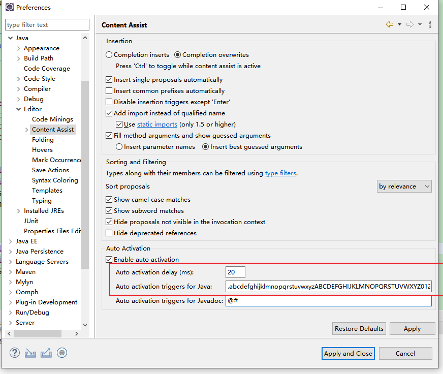

> 本文主要记录Eclipse的一些常用设置, Eclipse版本为2022-03

## 基本设置

### 常用默认快捷键

快捷键 | 描述
----|----
Ctrl+1 | 快速修复（最经典的快捷键，可以解决很多问题，比如 import 类、try catch 包围等）
Ctrl+Shift+F | 格式化当前代码
Ctrl+Shift+M | 添加类的 import 导入
Ctrl+Shift+O | 组织类的 import 导入（既有 Ctrl+Shift+M 的作用，又可以去除没用的导入，一般用这个导入包）
Ctrl+Y | 重做（与撤销 Ctrl+Z 相反）
Alt+/  | 内容辅助（用户编辑的好帮手，省了很多次键盘敲打，太常用了）
Ctrl+D | 删除当前行或者多行（不用为删除一行而按那么多次的删除键）
Alt+↓  | 当前行和下面一行交互位置
Alt+↑  | 当前行和上面一行交互位置
Ctrl+Alt+↓ | 复制当前行到下一行
Ctrl+Alt+↑ | 复制当前行到上一行
Shift+Enter | 在当前行的下一行插入空行（这时鼠标可以在当前行的任一位置，不一定是最后）
Ctrl+/ | 注释当前行，再按则取消注释
Alt+Shift+↑ | 选择封装元素
Alt+Shift+← | 选择上一个元素
Alt+Shift+→ | 选择下一个元素
Shift+← | 从光标处开始往左选择字符
Shift+→ | 从光标处开始往右选择字符
Ctrl+Shift+← | 选中光标左边的单词
Ctrl+Shift+→ | 选中光标右边的单词
Ctrl+←	| 光标移到左边单词的开头，相当于 vim 的 b
Ctrl+→	| 光标移到右边单词的末尾，相当于 vim 的 e
Ctrl+K	| 参照选中的 Word 快速定位到下一个（如果没有选中 word，则搜索上一次使用搜索的 word）
Ctrl+Shift+K | 参照选中的 Word 快速定位到上一个
Ctrl+J | 正向增量查找（按下 Ctrl+J 后，你所输入的每个字母编辑器都提供快速匹配定位到某个单词，如果没有，则在状态栏中显示没有找到了，查一个单词时，特别实用，要退出这个模式，按 escape 键）
Ctrl+Shift+J | 反向增量查找（和上条相同，只不过是从后往前查）
Ctrl+Shift+U | 列出所有包含字符串的行
Ctrl+H | 打开搜索对话框
Ctrl+G | 工作区中的声明
Ctrl+Shift+G | 工作区中的引用
debug-F5 | 单步跳入
debug-F6 | 单步跳过
debug-F7 | 单步返回
debug-F8 | 继续
debug-Ctrl+Shift+D | 显示变量的值
debug-Ctrl+Shift+B | 在当前行设置或者去掉断点
debug-Ctrl+R | 运行至行（超好用，可以节省好多的断点）
Alt+Shift+R | 重命名方法名、属性或者变量名 （尤其是变量和类的 Rename，比手工方法能节省很多劳动力）
Alt+Shift+M | 把一段函数内的代码抽取成方法 （这是重构里面最常用的方法之一了，尤其是对一大堆泥团代码有用）
Alt+Shift+C | 修改函数结构（比较实用，有 N 个函数调用了这个方法，修改一次搞定）
Alt+Shift+L | 抽取本地变量（可以直接把一些魔法数字和字符串抽取成一个变量，尤其是多处调用的时候）
Alt+Shift+F | 把 Class 中的 local 变量变为 field 变量 （比较实用的功能）
Alt+Shift+I | 合并变量
Alt+Shift+V | 移动函数和变量（不常用）
Alt+Shift+Z | 撤销（重构的后悔药）

### 设置编码格式

https://blog.csdn.net/lanmuhhh2015/article/details/79366872

https://blog.csdn.net/chinaxiaofeng8/article/details/82378736

https://blog.csdn.net/zengsange/article/details/83338392

### 自动提示

### 护眼模式

https://blog.csdn.net/qq1808814025/article/details/105929920

### 配置JDK

https://blog.csdn.net/qidasheng2012/article/details/78148379

### 显示内存使用情况

https://blog.csdn.net/ssxueyi/article/details/97014673

### 打开文件设置为单机打开

