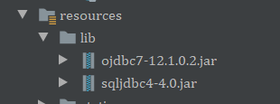

## springBoot设置启动样式

将自己的启动样式文件banner.txt放入默认路径resources下。  
如果自定义文件位置&文件名的话 需要修改yml配置：
```yaml
spring:
  banner:
    location: static/public/banner.txt
```

## springBoot设置时区

```yaml
spring:
  jackson:
    date-format: yyyy/MM/dd HH:mm:ss
    time-zone: GMT+8
```

## 多个配置文件

用于切换生产环境与测试环境配置，或者将较长的配置分离出去。

```yaml
spring:
  profiles:
    active: druid
    #切换配置文件
  #    spring.profiles.include: druid,ddd
```

## 文件上传限制

```yaml
spring:
  servlet:
    multipart:
      enabled: true
      max-file-size: 10MB 
      max-request-size: 20MB
```

## 跨域配置

### 方式一

```java
/**
 * 跨域配置
 *
 * @author: TangLiang
 * @date: 2021/1/2 10:12
 * @since: 1.0
 */
@Configuration
public class CorsConfig implements WebMvcConfigurer {
    static final String ORIGINS[] = new String[]{"GET", "POST", "PUT", "DELETE"};

    @Override
    public void addCorsMappings(CorsRegistry registry) {
        registry.addMapping("/**")
                .allowedOrigins("*")
                .allowCredentials(true)
                .allowedMethods(ORIGINS)
                .maxAge(3600);
    }
}
```

### 方式二

```java
/**
 * 全局跨域配置
 *
 * @author: TangLiang
 * @date: 2021/1/14 17:16
 * @since: 1.0
 */
@Configuration
public class GlobalCorsConfig {

    /**
     * 允许跨域调用的过滤器
     */
    @Bean
    public CorsFilter corsFilter() {
        CorsConfiguration config = new CorsConfiguration();
        //允许所有域名进行跨域调用
        config.addAllowedOrigin("*");
        //允许跨越发送cookie
        config.setAllowCredentials(true);
        //放行全部原始头信息
        config.addAllowedHeader("*");
        //允许所有请求方法跨域调用
        config.addAllowedMethod("*");
        UrlBasedCorsConfigurationSource source = new UrlBasedCorsConfigurationSource();
        source.registerCorsConfiguration("/**", config);
        return new CorsFilter(source);
    }
}
```

## 批量下载文件并放到压缩包

```java
@RestController
@RequiredArgsConstructor
public class RiderController {
    private final RiderService riderService;
    /**
     * 附件批量下载
     */
    @GetMapping(value = "downloadRiderList")
    @Log(title = "附件管理", operateType = "附件批量下载")
    public void downloadRiderList(String V_PERCODE, @RequestParam(value = "V_GUID_LIST") List<String> V_GUID_LIST, @RequestParam(value = "I_ID_LIST") List<Integer> I_ID_LIST, String mark, HttpServletRequest request, HttpServletResponse response) throws IOException, SQLException {
//目前批量下载各个文件并不大，所有可以走串行，如果以后有大文件的话，则需要异步下载，此代码暂时注释，以后如需异步时再用
//        List<CompletableFuture<Map<String, Object>>> list = new ArrayList<>();
//        for (int i = 0, length = V_GUID_LIST.size(); i < length; i++) {
//            CompletableFuture<Map<String, Object>> future = riderService.selectRiderBlobAsync(BaseUtils.getIp(request), V_PERCODE, V_GUID_LIST.get(i), I_ID_LIST.get(i));
//            list.add(future);
//        }
//        CompletableFuture<Map<String, Object>>[] completableFutures = list.toArray(new CompletableFuture[list.size()]);
//        CompletableFuture.allOf(completableFutures).join();
        try {
            String zipName = "【批量下载】" + mark + "等.zip";
            response.reset();
            response.setCharacterEncoding("UTF-8");
            response.setContentType("application/x-msdownload");
            response.setHeader("Content-Disposition", "attachment;filename=" + BaseUtils.getFormatString(request, zipName));

            ZipOutputStream zos = new ZipOutputStream(response.getOutputStream());
            for (int i = 0, length = V_GUID_LIST.size(); i < length; i++) {
                Map<String, Object> rider = riderService.selectRiderBlob(BaseUtils.getIp(request), V_PERCODE, V_GUID_LIST.get(i), I_ID_LIST.get(i));
                String fileName = (String) rider.get("V_FILENAME");
                Blob blob = (Blob) rider.get("result");
                if (blob != null) {
                    @Cleanup InputStream inputStream = blob.getBinaryStream();
                    //创建输入流读取文件
                    @Cleanup BufferedInputStream bis = new BufferedInputStream(inputStream);
                    //将文件写入zip内，即将文件进行打包
                    zos.putNextEntry(new ZipEntry(fileName));
                    //写入文件的方法，同上
                    int size = 0;
                    byte[] buffer = new byte[4096];
                    //设置读取数据缓存大小
                    while ((size = bis.read(buffer)) > 0) {
                        zos.write(buffer, 0, size);
                    }
                    //关闭输入输出流
                    zos.closeEntry();
                }
            }
            zos.close();
        } catch (IOException | SQLException e) {
            e.printStackTrace();
            response.setContentType("text/html;charset=utf-8");
            @Cleanup PrintWriter out = null;
            try {
                out = response.getWriter();
            } catch (IOException ex) {
                ex.printStackTrace();
            }
            out.print("<span style=\"display:block;text-align: center;margin:0 auto;min-width: 150px;\">" + e.getMessage() + "</span><br/>");
            out.print("<br/><button autocomplete=\"off\" onclick=\"javascript:window.history.back(-1);return false;\" autofocus=\"true\"\n" +
                    "            style=\"display:block;margin:0 auto;min-width: 150px;background-color:rgb(0, 138, 203);color: rgb(255, 255, 255);\">\n" +
                    "        返回上一个页面\n" +
                    "    </button>");
            out.flush();
        }
    }
}
```

## 引入本地jar包打包部署
当有的jar无法通过maven获取时，通过以下方式可以打包项目进行部署运行

1、在resources下面新建lib文件夹，并把jar包文件放到这个目录下



2、在pom文件定义几个依赖指向刚才引入的文件

```xml
        <dependency>
            <groupId>com.microsoft.sqlserver</groupId>
            <artifactId>sqljdbc4</artifactId>
            <version>4.0</version>
            <scope>system</scope>
            <systemPath>${project.basedir}/src/main/resources/lib/sqljdbc4-4.0.jar</systemPath>
        </dependency>
```

3. 在maven的pom里给springboot的打包插件引入一下参数

```xml
<includeSystemScope>true</includeSystemScope>
```


## 构造器注入解决循环依赖

```markdown
@RequiredArgsConstructor(onConstructor_ = {@Lazy, @Autowired})
```


